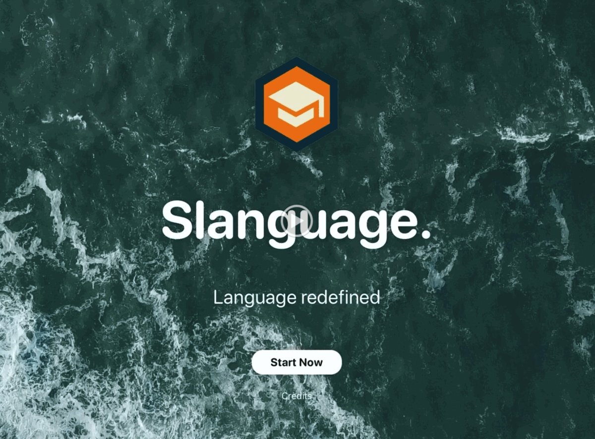
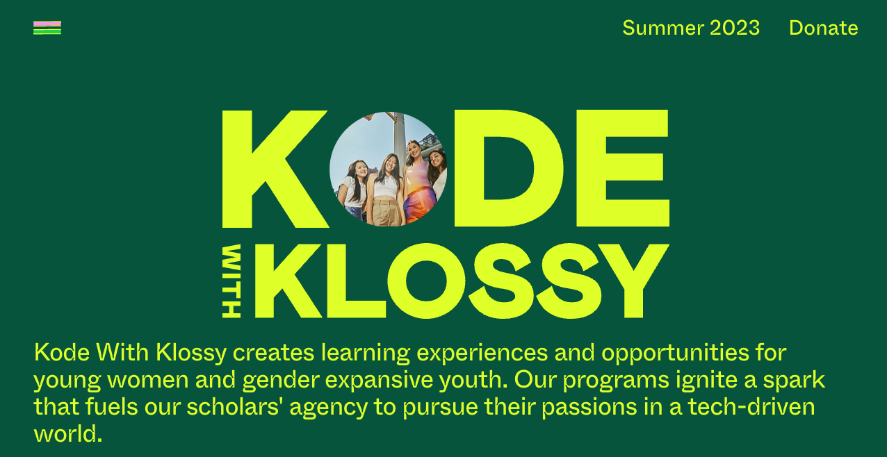

# Kode with Klossy: AI Project
In this summer program, I am the main developer to develop iOS app w/ SwiftUI and Xcode to enable language 
learners to identify objects
using a camera and translate them into common slang.
# Project Overview

# Demo Video
[Because of the program NDA requirements, we can't share the code.]
* This is the demo video where my app can capture real world objects in real time, identify and show different 
  common slangs in different languages for those objects.
#### [. ----> Click me for the 1m 26s video!](https://drive.google.com/file/d/1FG34ZRR3P-n23EUcbM_in8hkML3yVs_K/view?resourcekey&pli=1)

# Highlights of the program
* Collected object training data
* Studied supervised and unsupervised learning
* Artificial Intelligence/ Machine Learning used to recognize objects 
* Worked with Apple employees in the office for this year's program
* Researched how AI/ML affects bias and discrimination in the world
* Explored supervised vs unsupervised machine learning
* Met with successful female CEOs
* Learned how to develop iOS App
* Developed XCode and SwiftUI skills
* Presented to industry professionals
# [Kode with Klossy Program Information Link](https://www.kodewithklossy.com/)

